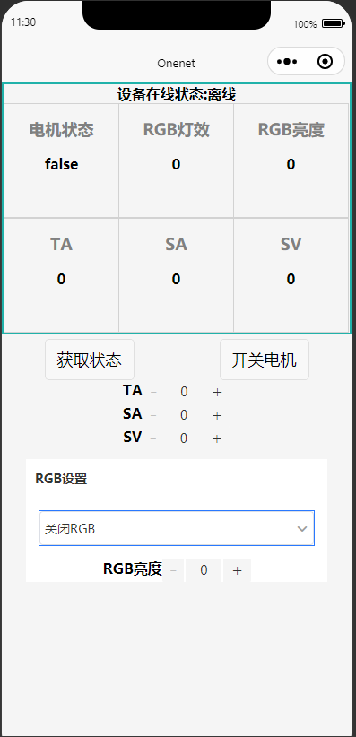

# OneNet 物联网设备云平台开发与实践 2021 Spring

## About
An introductory course about IoT devices. My team project is a clone version of a famous open-source project: 
plus my silly WeChat control platform.

- Stacks: Arduino+Wechat+Basic MQTT Knowledge

## Demo
### FOC

### WeChat
