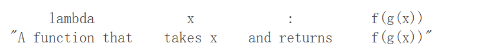
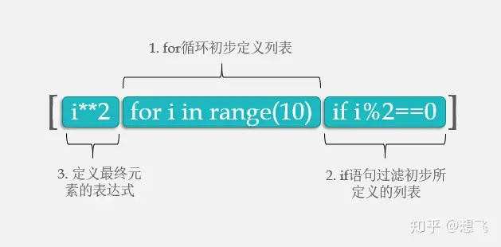
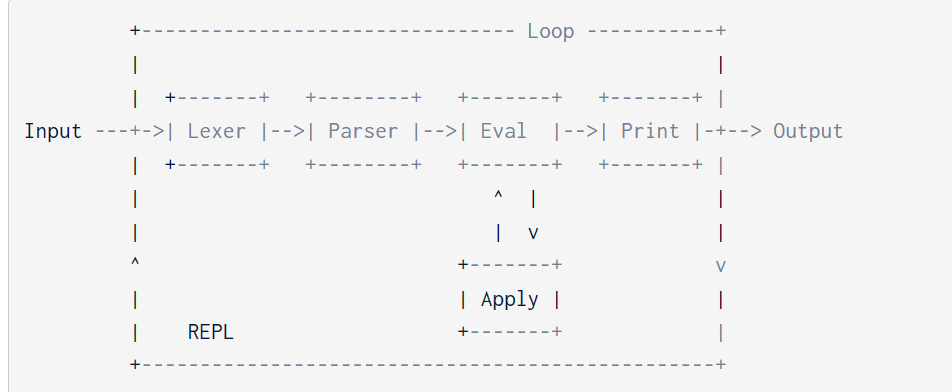

# UCB CS 61A: Structure and Interpretation of Computer Programs

## Foreword

These notes are for 61A 2023 Spring.

* [CS 61A Spring 2023 (berkeley.edu)](https://inst.eecs.berkeley.edu/~cs61a/sp23/)

My solutions at here: [](https://github.com/MorrisHohoho/UCB_CS_61A). **I set it to private due to course policies.**

You will learn:

1. Python
2. Basic Data Structure
3. Basic ideas of functional programming
4. Recursion, recursion and recursion
## Homework

### HW1-Functions, Control

Simple if, while stuffing.

### HW2-Higher-Order Functions, Lambda Expressions

#### Functions Design conventions

```python
def my_func(money,bank_money)
"""Here's should be the description of the function

   Here's more detail

   money -- parameter description
   bank_money -- parameter description
"""
   return money+bank_money
```

#### High-Order Functions

**High-Order Function ** is a function to call another function, which gives us a higher abstraction. 

However, defining multiple functions and passing them as parameters will consume our "frame". We can use **nested functions** to solve this problem.

```python
def funception(func1, start):
    """ Takes in a function (function 1) and a start value.
    Returns a function (function 2) that will find the product of
    function 1 applied to the range of numbers from
    start (inclusive) to stop (exclusive)

    >>> def func1(num):
    ...     return num + 1
    >>> func2_1 = funception(func1, 0)
    >>> func2_1(3)    # func1(0) * func1(1) * func1(2) = 1 * 2 * 3 = 6
    6
	"""
    "*** YOUR CODE HERE ***"
    def func2(stop): 
        temp = start
        if(temp<0):
            return None
        if(temp>=stop):
            return func1(temp)
        ret = 1
        while(temp<stop):
            ret *=func1(temp)
            temp+=1
        return ret
    return func2 
```

**==Warning:==**​== If you want to modify the value in h(x), the interpreter will throw an UnboundLocalError. There are two ways to solve it:==

1. Use `nonlocal`​ keyword
2. Assign the variable to a temp variable.(I choose this one, it's also the official solution)

#### Lambda Function



The HW2 of `mod_maker`​ is fun. `lambda x,y: x%y or True`​, which uses the short-circuiting of python

### HW3-Recursion

**Tree Recursion:**  A function with multiple recursive calls is said to be *tree recursive* because each call branches into multiple smaller calls, each of which branches into yet smaller calls, just as the branches of a tree become smaller but more numerous as they extend from the trunk.

The final question is kind of interesting.

### HW4-Data Abstraction

The former part of the HW4 is still about recursion. Once again, recursion means a function calls itself again and again.

```python
def recursion():
	Base Case():
		return ...
	Recusion Case():
		...
		return recursion()
	...(More operation)
```

The latter part is just a simple Data Abstraction stuff, very easy.

The whole process takes me about 2 and a half hours.

### HW5-Generators

It totally takes me about 3 hours.

#### What are Generators?

A generator is a special function used to create a more complex iterator.

```python
def ret_plus_minus(list):
	for i in list:
		yield i
		yield -i
 t  = ret_plus_minus(range(1,10))
next(t) # 1
next(t) # -1
## So generator can yield(return) more values.
```

It can be used in recursion--Q1  
It can be loop over--Q3&Q4 (Q3 is the most difficult one)  
It can also be used in high-order function--Q5

Keep in mind that the generator function only goes forward when it's called.

### HW6-OOP

It's some easy OOP stuff. If you fully understand the reading materials of chapter 2.5, it won't be a hard job.

It takes me around 1 hour.

### HW7-Linked List and Recursion

* **Time:**  Around 2 hours

**Q2:**  The recursion ends up at the List object. Do not pass `int`​​ into the recursion function. Otherwise, the original linked list won't be changed.

### HW9-SCHEME Intro

* **Time: 1 hour**​

Easy Scheme programming practice with some basic recursion knowledge.

### HW10-SCHEME Lists

* **Time: 1 hour**​

A little bit harder one. But it's still a recursion practice with scheme and its lists.

## Labs

### Lab 00-Start up

Just some environment setup guide and simple python stuff. 

1. Setup the python environment
2. Finish the `return`​
3. answer the python3 ok question

#### Doctest and Docstring

these features are used to do some testing. Like this:

```python
def test:
"""
this is  a test
>>> sum(1+2)
3
"""
```

And these lines of code will be executed like:

```python
Trying:
    add(1, 2)
Expecting:
    3
ok
```

### Lab 01-Functions and Control

simple stuff about `if`​, `while`​ stuff.

### Lab 02-Higher Order Functions, Lambda

#### Short Circuiting

If `and`​ and `or`​ do not *short-circuit*, they just return the last value; another way to remember this is that `and`​ and `or`​ always return the last thing they evaluate, whether they short circuit or not. Keep in mind that `and`​ and `or`​ don't always return booleans when using values other than `True`​ and `False`​.

For example:

```python
def f(x):
	if x>0:
		return "XXX"
	else:
		return "YYY"

>>>f(1) and f(-1)

# The above expression will return f(-1), because the f(-1) is the last thing that AND evaluate
```

### Lab 03-Review Lab

Easy

### Lab 04-Recursion and Sequence

Easy stuff, 1 hour.

#### Loop for n times

```python
for _ in range(3):
	print("Go Bears!")
```

This underscore is just another name in the environment as far as the interpreter is concerned but has a conventional meaning among programmers that indicates the name will not appear in any future expressions.

#### List comprehension



​`[<map expression> for <name> in <sequence expression=""> if <filter expression="">]`

```python
odds = [1,3,5,7,9]
[x for x in odds if 25 % x ==0]
# and odds will be [1,5]
```

### Lab 05-Data abstraction

It takes me approximately 40 minutes to complete the introductory object-oriented programming material, which is very easy.

### Lab 06-Mutability, Iterators

Easy stuff. Some exercises for familiarizing with the built-in function of Python.

For Q8: Pizza Sort, remember **==List Slicing returns a new list==**

It takes me about 90 mins

### Lab 07- OOP

Most parts of the lab are easy. But I got stuck on the final question.  It's so wired to define a `self.value`​ inside an `if`​ loop. 

After HW06 I see this point.

```python
class ClassA:
	class_value = 100 # Every instance of this class can use this variable.

	def __init__(self):
		self.instance_value = 0 # Only the instance itself can use this variable.

```

### Lab 08-OOP Cont.

Easy OOP stuff with some inheritance. It takes me about 50 mins.

### Lab 09-Mutable Trees, Efficiency

The last question is hard. It takes me around 1 hour to solve. The whole lab takes me around 2 hours. Now, let's dive into the last question.

The first thing we need to know is that the only difference between trees is the amounts of children. Like the following:

* [1,2,3]
* [1,2]

What we want to do is to add up the labels that come from different nodes. It's obviously a recursion problem, and the only odd situation is that the lengths of two trees are different. So, how can we deal with one node that has a label but the other doesn't?

One way is to add a **Node** node to the list to make sure that the lengths of two different trees are equal so we can use recursion. Like the following:

* [1,2,3]
* [1,2,None]

This idea is implemented by the codes before the final `return`​

Next, let's consider how to recursive. The basic logic is shown as the following:

```python
#base case

if t1==None:
	return t2
if t2==None:
	return t1
#Recursive Operation
new_label=t1.label+t2.label

#recursive case
new_label+add_trees(t1,t2)
```

It's easy to come up with. However, the difficult part is that we need to return a whole tree with a specific structure. `Tree(root,[children])`​.

For the root, it's the `new_label`​. For the children, we need to use `zip`​ to recursive:  
 `[add_trees(x1,x2) for x1,x2 in zip(t1,t2)]`​. add_tress will return a tree with children. zip(t1,t2) can let us iterate two objects at the same time. `For`​ will go over all the children of this node.

### Lab 10-Midterm Review

#### 1. Recursion

* **Time：**  90 mins

The key to recursion is to focus on the recursive cast. For these two subsequence questions, the key idea is `current element`​ + `subsequence`​ = new subsequence.

So, here comes the code `return (a+sub)+sub`​. The sub is exactly the recursive case--`sub(s[1:])`​

For the Q2, we want the increasing subsequence. But, if we still use the Q1 method, we can't get some subsequences. For example, `1,3,2`​, our recursive function will stop at `3,2`​ and subsequence `2`​ is left. So, we need to do a little trick to jump over that case and continue our recursion: use two separate recursions. One is the normal one `a`​, which don't go when the increasing rule is broken. The other one is the tricky one `b`​, it jumps over `3`​, and continues to recursive to get the following subsequences.  
Finally, we can add up them to forms our answer: `result = Add_to_first(s[0]+a)+b`​

#### 2. Left Part

* **Time:**  Around 2 hours

The left part of this mid-term review lab is easy. 

### Lab 11-Scheme Intro

* **Time： ** Around  40 mins

Easy stuff, which is mainly to help get familiar with the SCHEME.

### Lab 12- Interpreters

* **Time:**  Around 2 hours

I think the instruction for this lab is not clear. It took me a while to fully understand what the question meant. (Remember to watch the get started videos) 

The key idea of interpreters is shown in the following figure:



```python
# The eval calls apply,the apply also calls the eval
def Eval():
	check(operator)
	apply(operator,operands)

def apply():
	# perform the correct evaluation on the operands

	# Base case:
	if operands is nil:
		return ...

	# Recursion case
	after_evaluated = ...
	return Eval(after_evaluated)
```

==Also, ==​`==0 == False==`​== returns ==​`==True==`​==; But ==​`==0 is False==`​== return s==​`==False==`​==.==

### Lab 13 and 14-SQL Intro

* **Time:**  30 mins+30 mins

Very easy SQL stuff, just for practicing basic SQL operations like `SELECT`​, `GROUP BY`​, `HAVING`​...

## Project

### 1. Hog- a dice game

It's easy stuff,  but the philosophy of high-order function programming is good

* Total time:  Around  2 hours

### 2. Cats-Autocorected Typing Software

Problem 7 is kind of hard. But I finally figured it out.

So much recursion stuff, it takes me about 4 hours to finish it.

### 3. Ants-Plantes vs. Zombies Like games

The goal of this project is to practice coding with OOP metaphors. If you understand the instructions clearly, it's just easy and simple.

By the way, the images of this project are cute. 😆

### 4. Scheme interpereter

* **Total Time: ** Around 4 hours

Recursion, recursion, all about recursion. Most questions need you to think in a recursion way just like the REPL does. By the way, the syntax of the scheme sucks.  For the final optional question, which took me almost 1 hour, you need to:

1. Read the instructions carefully. Make sure that you fully understand the question.
2. Use `map`​ to deal with nesting recursion cases.

    1. (A,B,C,D,E)->A(X,Y,Z),B(,Q,W)...
    2. ​`map`​ will go through all the elements(A,B,C,D,E), which enables the program continue when the recursion of A is done.

‍
