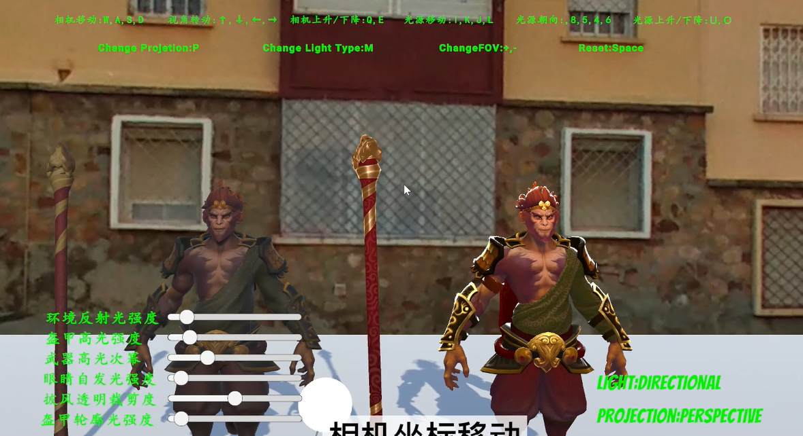

# 计算机图形学 2022 Fall

## About
This is also an introductory course about computer graphics. The final project requires you to implement your 3D-Object rendering. I chose a character from DOTA 2 and wrote a shader for it.

Here is the repository: 

## Demo

## Useful Resources
- [Games 101](https://www.bilibili.com/video/BV1X7411F744/)