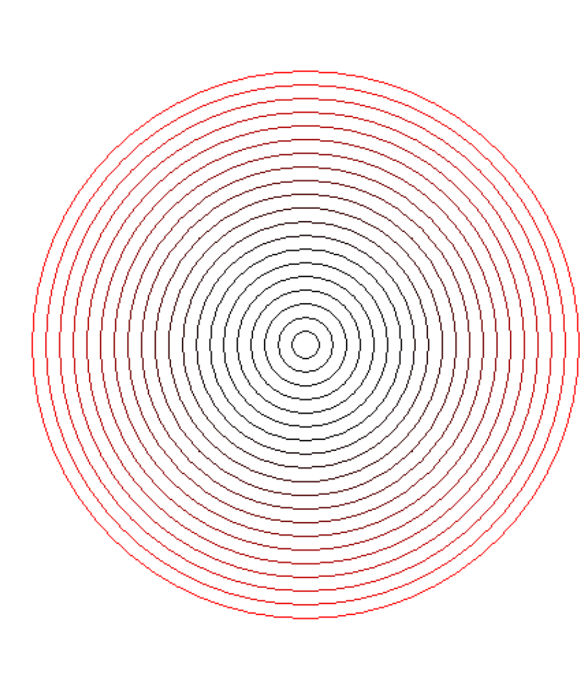

# 第一讲-基于图形绘制的游戏制作

## 安装EasyX，Visual Studio

官网直接下载就行了，安装程序非常人性化。课程推荐版本：VS2013,EasyX-2022

我的配置：VS2022,EasyX-2022

## EasyX初探-匀速运动效果

```C++
#include<graphics.h>
#include<stdio.h>
#include<iostream>
#include<conio.h>

int main()
{
	int y = 100;
	int step = 1;//运动速率

	initgraph(600, 800);//创建一个600*800的画布，默认底色为黑色
	cleardevice();//清除画布上所有图形

	//沿Y轴匀速运动
	for (y; y < 600; y = y + step)
	{
		fillcircle(300, y, 30);//实心圆，默认为白色
		Sleep(10);//暂停10ms
		cleardevice();//
	}

	_getch();//让画布停留
	closegraph();//关闭画布
	return 0;
}
```

## 作业1-渐变色同心圆环

```C++
#include<graphics.h>
#include<stdio.h>
#include<iostream>
#include<conio.h>

int main() {
	int radius = 200, red = 255;

	initgraph(600, 800);
	setbkcolor(RGB(255,255,255));
	cleardevice();

	setlinecolor(RGB(255, 0, 0));

	for (int i = 0; i < 20; i++)
	{
		circle(300, 300, radius);
		radius -= 10;
		red -= 20;
		if (red < 0)
		{
			red = 0;
		}
		setlinecolor(RGB(red, 0, 0));
	}

	_getch();
	closegraph();
	return 0;
}
```

**效果**：

 

## 作业二-自由落体和抛物线运动

**自由落体**

```C++
#自由落体
#include<graphics.h>
#include<stdio.h>
#include<iostream>
#include<conio.h>

int main()
{
	float x = 300, y = 100;
	float vy = 0, g = 0.5;
	initgraph(600, 800);
	cleardevice();
	while (1)
	{
		vy = vy + g;
		y = y + vy;
		if (y >= 770)
			vy = -0.95*vy;
		if (y > 770)
			y = 770;
		fillcircle(x, y, 30);
		Sleep(10);
		cleardevice();
	}
	_getch();
	closegraph();
	return 0;
}
```

**抛物线**

```C++
#抛物线
#include<graphics.h>
#include<stdio.h>
#include<iostream>
#include<conio.h>

int main()
{
	float x = 100, y = 100;
	float vy = 0, g = 0.5,vx=1,a=0.5;
	initgraph(600, 600);
	cleardevice();
	while (1)
	{
		vx = vx + a;
		vy = vy + g;
		y = y + vy;
		x = x + vx;
		if (y >= 570)
			vy = -0.95*vy;
		if (y > 570)
			y = 570;
		if (x >= 570||x<=30)
		{
			vx = -0.95*vx;
			a = -0.5*a;
		}
		fillcircle(x, y, 30);
		Sleep(10);
		cleardevice();
	}
	_getch();
	closegraph();
	return 0;
}
```

‍
