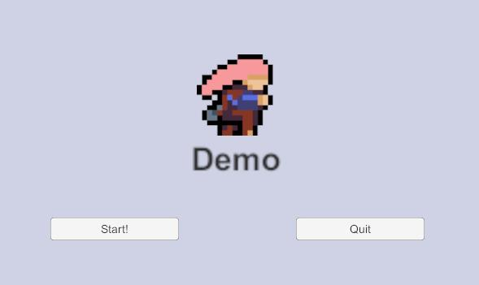
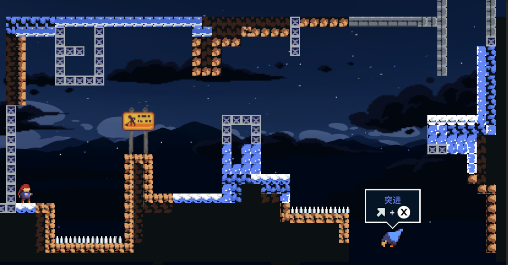
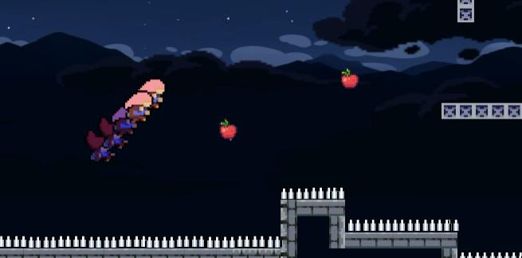

# 研究开发与实践 2022 Fall

## About

One of the most interesting courses at SCU. In this course, you will learn how to use EasyX to make games! You will be given some simple ideas every week and are asked to implement them through EasyX.

The final project requires you to make your own games based on your ideas. My project is "Fake Celeste", I made a Unity version of one of my favorite games: Celeste.

Here is the repository: .

## FakeCeleste
### Start Meu

### Mission 1

### Jumping
