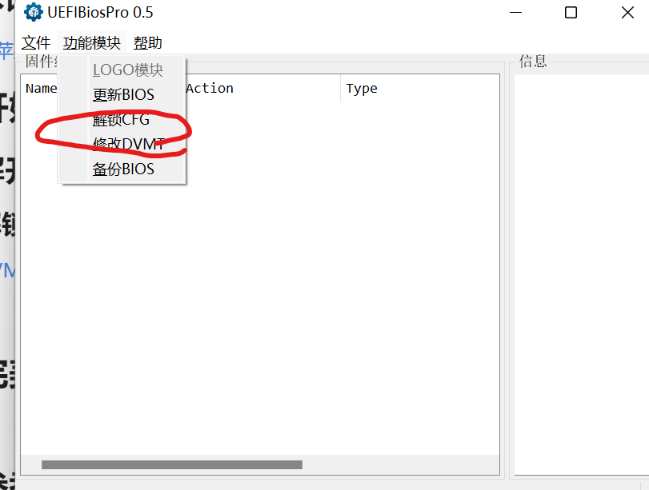
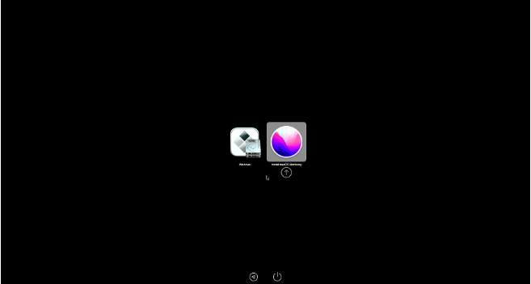
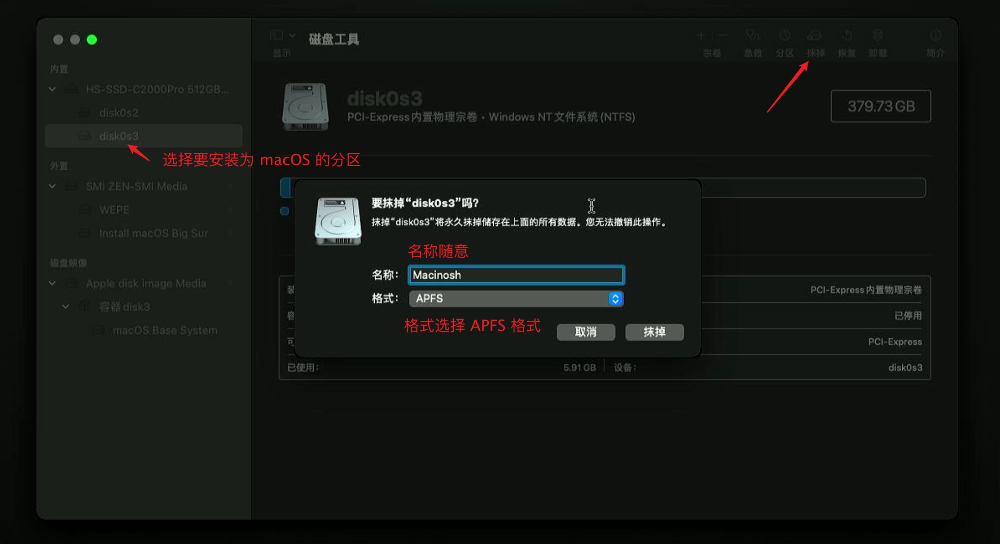
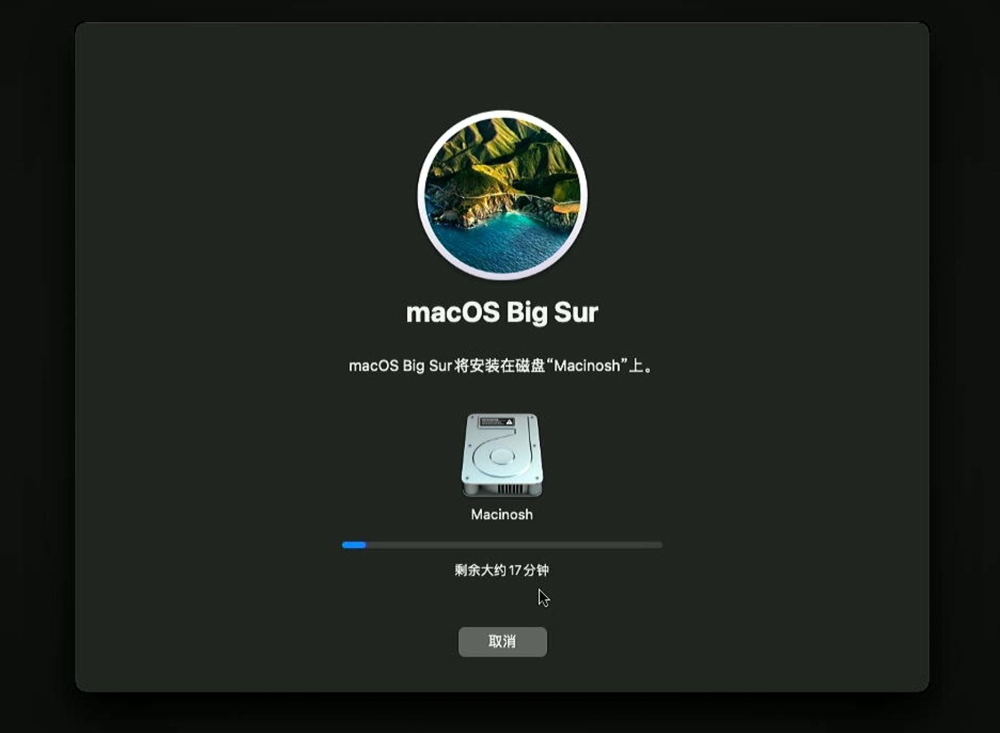
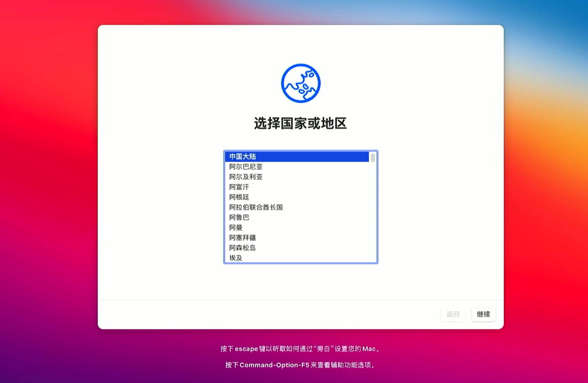
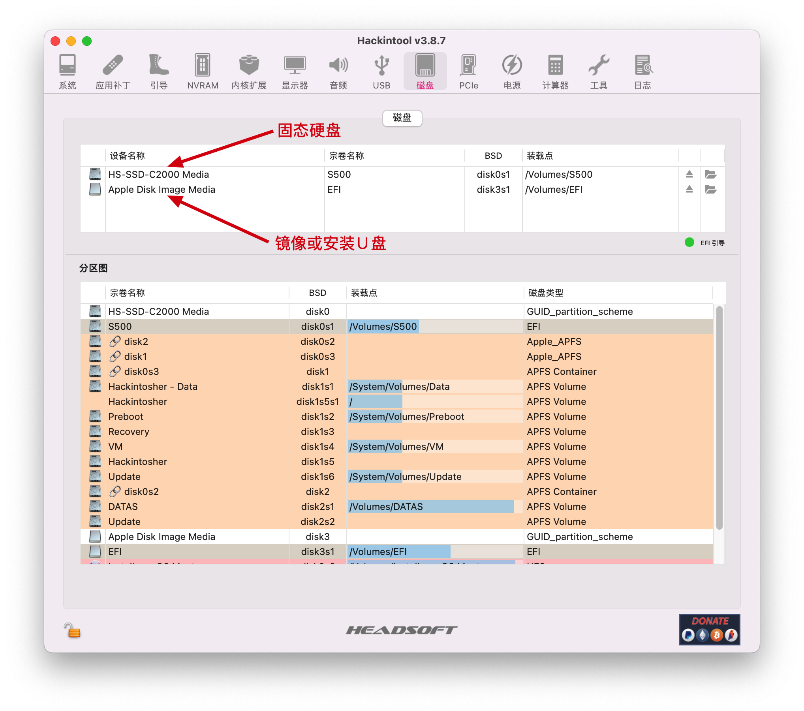
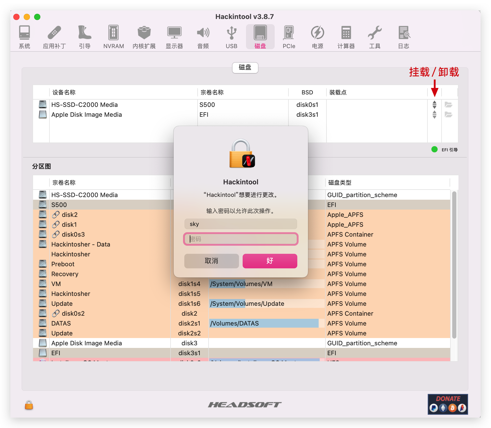
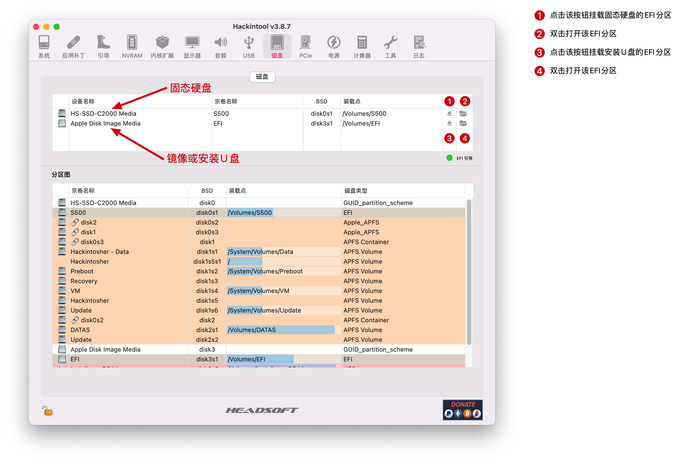
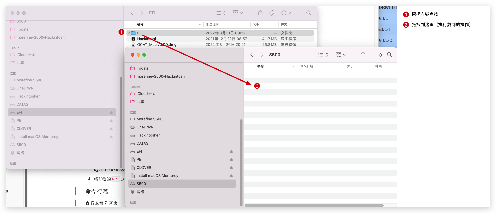

# 基于OC的hackintosh-以小新13pro 2020为例

## 设备情况

|规格|[详细信息](https://item.lenovo.com.cn/product/1007854.html)|
| :--------: | :-----------------------------------------------------: |
|电脑型号|联想小新pro13 笔记本电脑|
|操作系统|macOS （Monterey / Big Sur / Catalina / Mojave(`声卡异常`)|
|处理器|英特尔 酷睿 i5 - 10210U |
|内存|16GB板载无法更换|
|硬盘|PCIEX4，[混搭](https://zhuanlan.zhihu.com/p/89874980), 以下针对安装 macOS 下说明|
|显卡|Intel HD Graphics CFL CRB|
|显示器|13.3 英寸 IPS 2560x1600|
|声卡|Realtek ALC257|
|网卡|[原装网卡AX201] ( [Intel网卡](https://github.com/daliansky/XiaoXinPro-13-hackintosh/wiki/Intel%E7%BD%91%E5%8D%A1) / [BCM94360Z4](https://github.com/daliansky/XiaoXinPro-13-hackintosh/wiki/BCM94360Z4%E5%9B%9B%E5%A4%A9%E7%BA%BF) / [白果拆机网卡](https://github.com/daliansky/XiaoXinPro-13-hackintosh/wiki/%E7%99%BD%E6%9E%9C%E6%8B%86%E6%9C%BA%E7%BD%91%E5%8D%A1) )|
|官方BIOS|搜【[小新pro 13 Intel](https://newsupport.lenovo.com.cn/search_result.html?q=%E5%B0%8F%E6%96%B0pro%2013%20Intel)】 选【小新 Pro-13 2019(2020)(Intel平台：IML版)】|

## 前期准备

### 硬盘

拆开背板查看SSD型号，如果是三星的PM系列，会导致内核崩溃，无法使用，赶紧更换。

### 网卡

如果不换网卡，使用Intel原生网卡，需要自行打上驱动。打上驱动后蓝牙和WIFI正常使用，但是巡航，隔空投送等苹果特色功能无法使用。  
都折腾黑苹果了，为什么不折腾个完美的出来呢？因此我们需要替换网卡，以实现苹果特色功能。

Mac网卡科普：[Hackintosh黑苹果无线网卡入手指南（PCIE篇） - 知乎 (zhihu.com)](https://zhuanlan.zhihu.com/p/339648390)

根据帖子数据和实际实用情况，我们选择价格相差不多但性能更好的94360cd（2022/9/21，闲鱼价格：118）。同时还需WIFI m.2转接卡(就是NGFF，NGFF后面改名成m.2了），淘宝上很多，~~我们买个反向转接卡。正向的太长了，笔记本装不下。~~ （正向反向的都行，没什么区别，反向的用不了笔记本自带的两根天线）

 BCM94360cd的接口是IPEX1代，小新自带的是IPEX4代，完全对不上，需要重新买4根新的天线。同时J3接口是蓝牙接口，其他的全是无线接口。同同时，网卡的接口在芯片背面。

就接两根天线也不是不行，一根接J3，一根随便接，蓝牙和WIFI均可正常使用，且速度和信号非常不错。

### 术语

[黑苹果新手指导：名词解释&amp;常用软件&amp;常见问题说明-黑苹果星球 (heipg.cn)](https://heipg.cn/tutorial/faq-for-beginners.html)

## 制作安装盘

### 下载镜像

[分类: 镜像 | 黑果小兵的部落阁 (daliansky.net)](https://blog.daliansky.net/categories/%E4%B8%8B%E8%BD%BD/%E9%95%9C%E5%83%8F/)

阅读原文，打赏1元就能获取到最新镜像了。

### 刷入镜像

首先先用MD5校验工具[WinMD5 Free - Windows MD5 Utility Freeware for Windows 7/8/10/11](https://www.winmd5.com/)，校验镜像是否下载正确。确保MD5码无误再进行下一步。

准备一个16G以上的U盘且无重要数据的U盘。

[balenaEtcher - Flash OS images to SD cards &amp; USB drives](https://www.balena.io/etcher/)下载镜像制作工具，同样时傻瓜式的，选择镜像，选择刷入介质，点击启动，等待它刷好即可。

### 替换EFI

[数据恢复软件,硬盘分区工具,系统备份软件 - DiskGenius官方网站](https://www.diskgenius.cn/)下载DiskGenius，免费版的完全够用。

[【黑果小兵】Hackintosh黑苹果长期维护机型整理清单 | 黑果小兵的部落阁 (daliansky.net)](https://blog.daliansky.net/Hackintosh-long-term-maintenance-model-checklist.html#lenovo-%E8%81%94%E6%83%B3)在这里找到自己的机型，下载相关EFI。当然了也可以自己配，不过需要多学点东西。

EFI一般都会在GitHub上发布，在Github上又有一个问题，图片看不见怎么办？不用怕，改一下hosts就行，打开

```C++
C:\Windows\System32\drivers\etc\hosts
```

在文件末尾添加

```C++
# GitHub Start 
192.30.253.112    Build software better, together 
192.30.253.119    gist.github.com
151.101.184.133    assets-cdn.github.com
151.101.184.133    raw.githubusercontent.com
151.101.184.133    gist.githubusercontent.com
151.101.184.133    cloud.githubusercontent.com
151.101.184.133    camo.githubusercontent.com
151.101.184.133    avatars0.githubusercontent.com
151.101.184.133    avatars1.githubusercontent.com
151.101.184.133    avatars2.githubusercontent.com
151.101.184.133    avatars3.githubusercontent.com
151.101.184.133    avatars4.githubusercontent.com
151.101.184.133    avatars5.githubusercontent.com
151.101.184.133    avatars6.githubusercontent.com
151.101.184.133    avatars7.githubusercontent.com
151.101.184.133    avatars8.githubusercontent.com

 # GitHub End
```

打开Disk Genius后会发现U盘有三个分区，分别是Winodws PE、Clover、OpenCore。多余的空间，用DiskGenius修改一下格式就能当作普通U盘使用。我们把OpenCore分区里的BOOT删除，然后更换上我们下载好的EFI就算替换成功。

### 解开硬件限制

#### 解锁DVMT、开启CFG CLOCK

[DVMT补丁 · daliansky/XiaoXinPro-13-hackintosh Wiki (github.com)](https://github.com/daliansky/XiaoXinPro-13-hackintosh/wiki/DVMT%E8%A1%A5%E4%B8%81#%E6%B5%8B%E8%AF%95%E7%89%88bios)一键工具，傻瓜式使用。



点一下然后重启电脑就好。  
这个步骤一定要做，否则OC引导时会卡在废话模式。

#### 禁用安全启动

开机时狂按F12（不行就Fn+F12）进Bios，然后再Security中将Secure Boot禁用后，保存重启即可。

## 开始安装！

按前面的流程一套走下来，不出问题的话，后面就没什么难度了。（~~要是出问题了，那就难搞了~~）  
插入U盘，狂按F2（Fn+F2），选择OpenCore启动（应该是U盘启动项的第一个）。



进入OpenCore界面后，点击Install MacOS，格式化磁盘



格式化后，退出磁盘工具，点击安装MacOS，选择刚才格式化好的盘，一路按继续，等它开始读条，安装进程就开始了。



安装途中，电脑会重启很多遍，每次重启时，依旧选择OpenCore启动。进OpenCore后会发现多了一个MacOS installer。这个就是重启之前的安装进程，启动这个进程，继续等它读条就行了。

​

读条结束后，出现这个画面，恭喜，一切顺利！后续就按正常电脑使用一样，一路继续即可。

## 后续设置

### 完善EFI

现在的EFI还在U盘里，未挂载在系统硬盘上，每次启动都要插个U盘，蠢得够可以的。所以，我们需要将EFI挂载到系统硬盘上，直接通过硬盘引导。

[Releases · headkaze/Hackintool (github.com)](https://github.com/headkaze/Hackintool/releases)下载工具Hackintool

（下述图片来自[morefine S500兼Monterey安装教程 | 黑果小兵的部落阁 (daliansky.net)](https://blog.daliansky.net/Morefine-S500-and-macOS-Monterey-Installation-Tutorial.html)）





​

​

### 开启HiDPi

配置要配全套，苹果自定标准HiDPi怎么能不用呢？

（以下内容出自[开启 HiDPi - 国光的黑苹果安装教程：手把手教你配置 OpenCore (sqlsec.com)](https://apple.sqlsec.com/6-%E5%AE%9E%E7%94%A8%E5%A7%BF%E5%8A%BF/6-5/)）

#### HiDPi 是啥[¶](https://apple.sqlsec.com/6-%E5%AE%9E%E7%94%A8%E5%A7%BF%E5%8A%BF/6-5/#hidpi "Permanent link")

简单来说是苹果一直使用的显示技术，通过多个像素点合成一个像素点来提高清晰度，当显示器达到苹果定义的视网膜标准时，会自动开启 HiDPi，MBP 全系列都开启了 HiDPi，如果你自己购买 4k 显示器的话，默认也是开启 HiDPi 的，或者使用 4k 笔记本黑苹果的时候（XPS 系列），也是自动开启 HiDPi 的。

HiDPi 因为牺牲像素点的原因，虽然看上去会比原来清晰，但是实际看上去的分辨率会低，相当于是牺牲分辨率换清晰度，所以 1080P 显示器开启 HiDPi 的话，最终显示的效果接近于 720P，这么看的话，2k 分辨率的设备更适合 HiDPi（高不成 低不就）。

直接在Terminal中输入`sh -c "$(curl -fsSL https://html.sqlsec.com/hidpi.sh)"`，按照提示输入相关信息就行。在这个时候顺便可以把EDID（显示器ID）也注入了，让显示器信息显示MacBook Pro，多帅嘛。

​

## 完美度检测

[黑苹果 - 国光的黑苹果安装教程：手把手教你配置 OpenCore (sqlsec.com)](https://apple.sqlsec.com/7-%E5%AE%8C%E7%BE%8E%E9%BB%91%E6%9E%9C/7-1/)按照这个帖子自己排排错就行。硬要折腾的话，没个头。

本次教程的EFI已经很完善了，除了睡眠和内置Mic、摄像头无法使用外，其他的功能一切正常。（~~屏幕有时候会花屏，合盖再打开一次就行，小问题~~）

## 参考帖子

* [使用BCM94360CS2小新pro13 卡屏死机可能的解决办法-远景论坛-微软极客社区 (pcbeta.com)](https://bbs.pcbeta.com/viewthread-1846508-2-1.html)
* [小新pro13换网卡选择-远景论坛-微软极客社区 (pcbeta.com)](https://bbs.pcbeta.com/viewthread-1902541-1-1.html)
* [白果拆机网卡 · daliansky/XiaoXinPro-13-hackintosh Wiki (github.com)](https://github.com/daliansky/XiaoXinPro-13-hackintosh/wiki/%E7%99%BD%E6%9E%9C%E6%8B%86%E6%9C%BA%E7%BD%91%E5%8D%A1)
* [主页 - 国光的黑苹果安装教程：手把手教你配置 OpenCore (sqlsec.com)](https://apple.sqlsec.com/)
* [联想小新Pro 13黑苹果详细安装教程 - 知乎 (zhihu.com)](https://zhuanlan.zhihu.com/p/137962292)

‍
